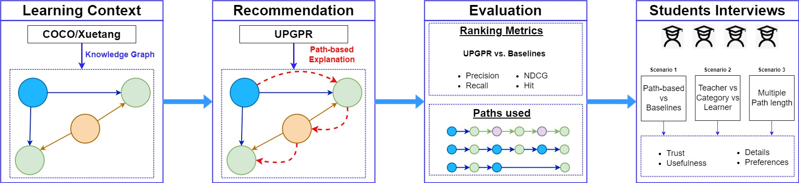

# Finding Paths for Explainable MOOC Recommendation: A Learner Perspective<!-- omit from toc -->

This repository contains code for the paper [Finding Paths for Explainable MOOC Recommendation: A Learner Perspective.](https://arxiv.org/abs/2312.10082)



## Table of Contents<!-- omit from toc -->

- [Datasets](#datasets)
- [Installation](#installation)
- [How to run UPGPR on Xuetang](#how-to-run-upgpr-on-xuetang)
- [How to run UPGPR on COCO](#how-to-run-upgpr-on-coco)
- [How to run the baselines](#how-to-run-the-baselines)
- [Citation](#citation)

## Datasets

<details>

<summary>Datasets</summary>

### Xuetang

Download Xuetang from [http://moocdata.cn/data/MOOCCube](http://moocdata.cn/data/MOOCCube), extract the file and place the MOOCCube folder in data/mooc/

You should get two folders:

- data/mooc/MOOCCube/entities/
- data/mooc/MOOCCube/relations/

### COCO

Get the coco dataset by contacting the authors of [COCO: Semantic-Enriched Collection of Online Courses at Scale with Experimental Use Cases](https://link.springer.com/chapter/10.1007/978-3-319-77712-2_133) by email. Extract the file and place it in data/coco/

You sould get one folder:

- data/coco/coco/

Note: Because you might get a more recent version of the dataset, some of the characteristics (number of learners, courses, etc... ) might be different.

</details>

## Installation

<details>

<summary>Installation</summary>

### Requirements

Python 3.10 is required

If you intent to run the skill extractor on the coco datset, you will need to download en_core_web_lg:

```bash
python -m spacy download en_core_web_lg
```

### Install required packages

```bash
pip install -r requirements.txt
```

### Install RecBole for the baselines

Install RecBole from source (can be done in any directory)

```bash
 git clone https://github.com/RUCAIBox/RecBole.git && cd RecBole
```

```bash
pip install -e . --verbose
```

</details>

## How to run UPGPR on Xuetang

<details>

<summary>UPGPR on Xuetang</summary>

### Process Xuetang's original files

```bash
python src/UPGPR/preprocess_mooc.py
```

After this process, all the files from MOOCCUbe have been standardized into the format needed by PGPR. The files are saved in the folder data/mooc/MOOCCube/processed_files.

We used the same file format as in the original PGPR repoisitory: [https://github.com/orcax/PGPR](https://github.com/orcax/PGPR).

### Xuetang's Dataset and Knowledge Graph creation

```bash
python src/UPGPR/make_dataset.py --config config/mooc.json
```

After this process, the files containing the train, validation and test sets and the Knowledge Graph have been created in tmp/mooc.

### Train the Xuetang's Knowledge Graph Embeddings

```bash
python src/UPGPR/train_transe_model.py --config config/mooc.json
```

The KG embeddings are saved in tmp/mooc.

### Train the RL agent on Xuetang

```bash
python src/UPGPR/train_agent.py --config config/UPGPR/mooc.json
```

The agent is saved in tmp/mooc.

### Evaluation on Xuetang

```bash
python src/UPGPR/test_agent.py --config config/UPGPR/mooc.json 
```

The results are saved in tmp/mooc.

</details>

## How to run UPGPR on COCO

<details>

<summary>UPGPR on COCO</summary>

### Extract the skills from COCO's course descriptions

```bash
python src/UPGPR/extract_skills.py
```

After this process

### Process coco's original files

```bash
python src/UPGPR/preprocess_coco.py 
```

After this process, all the files from coco have been standardized into the format needed by PGPR. The files are saved in the folder data/mooc/MOOCCube/processed_files.

We used the same file format as in the original PGPR repoisitory: [https://github.com/orcax/PGPR](https://github.com/orcax/PGPR).

### COCO's Dataset and Knowledge Graph creation

```bash
python src/UPGPR/make_dataset.py --config config/UPGPR/coco.json
```

After this process, the files containing the train, validation and test sets and the Knowledge Graph have been created in tmp/mooc.

### Train the COCO's Knowledge Graph Embeddings

```bash
python src/UPGPR/train_transe_model.py --config config/UPGPR/coco.json
```

The KG embeddings are saved in tmp/coco.

### Train the RL agent on COCO

```bash
python src/UPGPR/train_agent.py --config config/UPGPR/coco.json
```

The agent is saved in tmp/coco.

### Evaluation on COCO

```bash
python src/UPGPR/test_agent.py --config config/UPGPR/coco.json 
```

The results are saved in tmp/coco.

</details>

## How to run the baselines

<details>

<summary>Baselines</summary>

### Process the files for Recbole

Process the Xuetang files for RecBole (requires data/mooc/MOOCCube/processed_files)

```bash
python src/baselines/format_moocube.py
```

After this process, all the files from coco have been standardized into the format needed by RecBole. The files are saved in the folder data/mooc/recbolemoocube.

We follow the same process for coco:

```bash
python src/baselines/format_coco.py
```

The files are saved in the folder data/coco/recbolecoco.

### Run the baselines

To run the baselines, choose a config file in config/baselines and run the following:

```bash
python src/baselines/baseline.py --config config/baselines/coco_Pop.yaml
```

This example runs the Pop baseline on the coco dataset.

</details>

## Citation

```tex
@article{frej2023finding,
  title={Finding Paths for Explainable MOOC Recommendation: A Learner Perspective},
  author={Frej, Jibril and Shah, Neel and Kne{\v{z}}evi{\'c}, Marta and Nazaretsky, Tanya and K{\"a}ser, Tanja},
  journal={arXiv preprint arXiv:2312.10082},
  year={2023}
}
```
